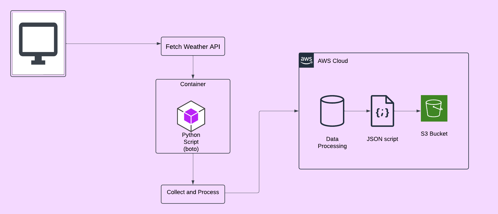

# Weather Dashboard

## Overview
The Weather Dashboard is a Python application designed to fetch real-time weather data for specified cities using the OpenWeather API and store the data in an AWS S3 bucket. This project demonstrates core DevOps principles, including API integration, cloud storage, infrastructure as code, version control, and environment management.

## Architectural Diagram


## Table of Contents
- Features
- Technical Architecture
- Project Structure
- Prerequisites
- Installation
- Usage
- What You Will Learn
- Future Enhancements
- License
- Acknowledgements

## Features
- Fetches real-time weather data for multiple cities
- Displays temperature (°F), humidity, and weather conditions
- Automatically stores weather data in AWS S3
- Supports tracking weather data for multiple cities
- Timestamps all data for historical tracking

## Technical Architecture
- **Language**: Python 3.x
- **Cloud Provider**: AWS (S3)
- **External API**: OpenWeather API
- **Dependencies**:
  - `boto3` (AWS SDK)
  - `requests` (HTTP library)
  - `python-dotenv` (Environment variable management)

## Project Structure
weather-dashboard/
├── src/
│   ├── __init__.py
│   └── weather_dashboard.py
├── tests/
├── data/
├── .env
├── .gitignore
└── requirements.txt

## Prerequisites
- Python 3.x
- AWS account with S3 access
- OpenWeather API key

## Installation
1. **Clone the repository:**
   ```bash
   git clone https://github.com/yourusername/weather-dashboard.git
   cd weather-dashboard
   ```

2. **Create a virtual environment and activate it:**
   ```bash
   python -m venv venv
   source venv/bin/activate  # On Windows use `venv\Scripts\activate`
   ```

3. **Install the required packages:**
   ```bash
   pip install -r requirements.txt
   ```

4. **Create a `.env` file in the project root and add your environment variables:**
   ```
   OPENWEATHER_API_KEY=your_openweather_api_key
   AWS_BUCKET_NAME=your_s3_bucket_name
   AWS_ACCESS_KEY_ID=your_aws_access_key_id
   AWS_SECRET_ACCESS_KEY=your_aws_secret_access_key
   ```

5. **Configure AWS credentials:**
   ```bash
   aws configure
   ```

## Usage
1. **Run the application:**
   ```bash
   python src/weather_dashboard.py
   ```

2. **The application will:**
   - Ensure the specified S3 bucket exists.
   - Fetch weather data for the cities listed in the `main()` function.
   - Print the weather data to the console.
   - Save the weather data to the S3 bucket in JSON format.

## What You Will Learn
- **AWS S3 Management**: How to create and manage S3 buckets.
- **Environment Variable Management**: Securely manage API keys and other sensitive information.
- **Python Best Practices**: Best practices for API integration and error handling.
- **Git Workflow**: Use Git for version control and project development.
- **Error Handling**: Implement robust error handling for distributed systems.
- **Cloud Resource Management**: Manage cloud resources effectively.

## Future Enhancements
- **Add Weather Forecasting**: Extend the application to include weather forecasts.
- **Implement Data Visualization**: Add data visualization for better insights.
- **Expand City List**: Track weather data for more cities.
- **Automated Testing**: Create automated tests to ensure code quality.
- **CI/CD Pipeline**: Set up a CI/CD pipeline for continuous integration and deployment.

## License
This project is licensed under the MIT License. See the LICENSE file for details.

## Acknowledgements
- OpenWeather for providing the weather API.
- AWS for cloud storage services.

